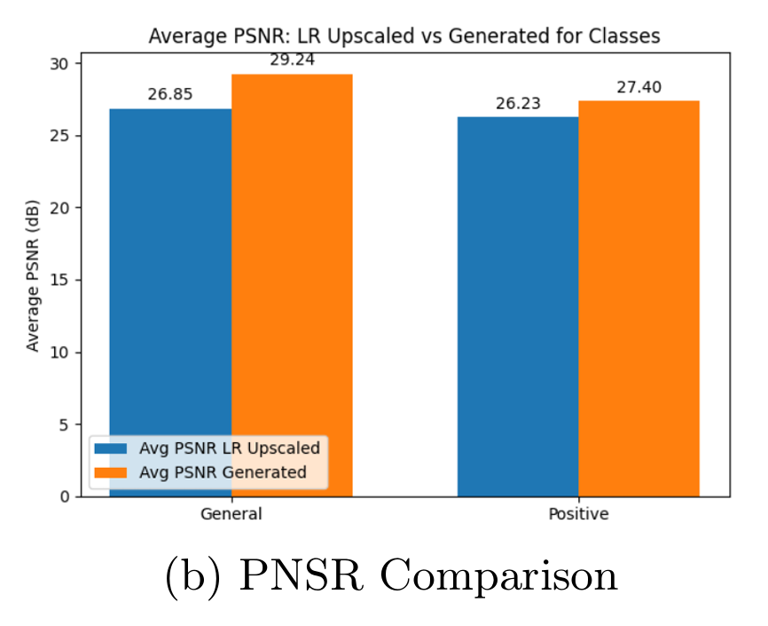

# MRI Super-Resolution using GAN

This project implements a Generative Adversarial Network (GAN) to enhance low-resolution MRI brain images into high-resolution images. The objective is to generate high-quality MRI scans to assist in tumor detection and diagnosis, particularly when the original data is noisy or degraded.

---


## Introduction

High-resolution MRI is essential for accurate medical diagnostics, but its acquisition is limited by long scan times and hardware constraints, which can compromise precision. To overcome this, MRI super-resolution (SR) techniques aim to reconstruct high-resolution images from low-resolution inputs. While traditional methods often produce blurry results and are restricted to certain parts of the body, deep learning, particularly Generative Adversarial Networks (GANs), has shown promise by generating more realistic and detailed images. Despite challenges like training instability and small datasets, GAN-based models are effective for improving MRI resolution and fidelity. The main goal of this project is to develop and implement a GAN-based SR model to convert 128x128 MRI images to 256x256, and then compare its performance against other methods to identify the most reliable approach for enhancing image quality and preserving anatomical accuracy.

---

## Important Details


### 🗂️ Project Structure

```bash
nlp/
│
├── Data/
│   ├── filtered_high/           # High-resolution original MRI images
│   └── filtered_low/            # Low-resolution original MRI images
│
├── largeFiltered/               # Preprocessed MRI images for training (both HR and LR)
│
├── final_model/                 # Saved pretrained GAN model
│
├── mri-positive/                # Real MRI images with detected tumors
├── noised-mri-positive/         # Noisy/low-res versions of tumor images
├── generated-positive-mri/      # Output of GAN model on positive cases
│
├── copyof mri2/                 # Folder with the main GAN training code
│
└── testing.ipynb                # Final evaluation notebook for pretrained model
│
├── explian-images/              # Contains images used in readme.md file
├── Project_Conference_Paper/    # Conference Paper with detailed explanation
└── requirements.txt             # Final evaluation notebook for pretrained model
```


1. GAN architecture
   - This is the simple GAN architecture which can run on the Google Colab we can modify and add more layers for robustness. 
<p align="center">
  
</p>


2. Originl 512x512 High resolution images
    - We have not used them directly as the GPU usage is directly depending on the resolution, having less GPU capcacity we used 256x256 as the high resolution images
    - Note that in provided Dataset most of them are 512x512 but some are less and more than that (around 20-25) so we have dropped them. 
<p align="center">
  
</p>


3. Transformed For 256x256 from 512x512
<p align="center">
  
</p>


4. Input low-high resolution pair for Model
   - High resolution = 256x256
   - Low resolution = 128x128 
<p align="center">
  
</p>

5. Model output comparison visually
   - High res = 256x256
   - Generated = 256x256 (models output)
   - Low res = 128x128
<p align="center">
  
</p>


6. PNSR Comparison
<p align="center">
  
</p>


7. MSE Comparison
<p align="center">
  
</p>

8. SSIM Comparison
<p align="center">
  
</p>

---

## 🧠 Project Highlights

- Trained a GAN on paired low and high resolution MRI images.
- Used preprocessed and filtered datasets to ensure data quality.
- Evaluated the model on both clean and noisy tumor-affected MRI scans.
- Final trained model included for reuse and evaluation.
 
---


🚀 How to Run
1. Clone the Repository
```bash
git clone https://github.com/ManojPandekamat/nlp.git
cd nlp
```

2. Install Dependencies
```bash
pip install -r requirements.txt
```
3. Train the Model (Optional)
```
MRI.ipynb
use a Jupyter Notebook to explore and train interactively.
```
4. Evaluate the Model
```
jupyter notebook testing.ipynb
Compares outputs from generated-positive-mri with real tumor-affected MRI images.
```

## 🧪 Results

**The model successfully enhances noisy MRI images.**

- Generated outputs from generated-positive-mri visually match the original mri-positive set.
- Quality gain demonstrated through qualitative evaluation.

> 🧠 About the Pretrained Model
> Located in the final_model/ directory.
> Can be directly loaded for inference without retraining.
- Works well on unseen noisy tumor images.

## 📌 TODO / Ideas
- Include automatic evaluation metrics (e.g., PSNR/SSIM calculation scripts).
- Build a simple UI for medical professionals to upload low-res scans and view results.
- Use diffusion models or transformers for performance comparison.
